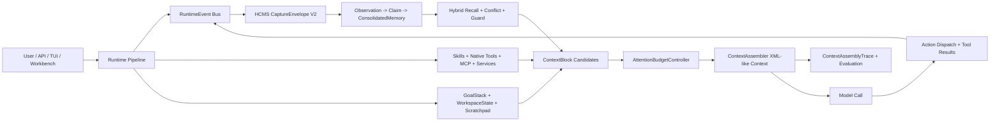

<p align="center">
  
</p>

<p align="center">
  <a href="./README.md">English</a> |
  <a href="./README_zh.md">中文</a>
</p>

<h1 align="center">Anvil</h1>

<p align="center">
  <strong>HCMS V2 + Runtime Context V2 for agents that remember, reason, use tools, and evolve under one auditable runtime.</strong>
</p>

<p align="center">
  <a href="https://github.com/q2805187159/Anvil/actions/workflows/ci.yml"></a>
  <a href="./backend/pyproject.toml"></a>
  <a href="./frontend/package.json"></a>
  <a href="./docker-compose.yml"></a>
  <a href="./LICENSE"></a>
</p>

Anvil is a harness-first agent runtime for building serious operator systems: long-session memory, budgeted context assembly, typed tools, MCP extensions, skills, isolated execution, structured traces, gateway APIs, a CLI/TUI, and a browser workbench all driven by the same runtime contracts.

The new V2 stack turns memory and context from prompt appendices into first-class control-plane data. HCMS V2 captures evidence as Observation -> Claim -> ConsolidatedMemory, while Runtime Context V2 converts memory, files, tools, workspace state, goals, warnings, and capability hints into auditable `ContextBlock` objects that compete for attention budget before every model call.

## Why Star Anvil

| Capability | Why it matters |
| --- | --- |
| HCMS V2 memory engine | Three-state knowledge flow, evidence spans, conflict records, forgetting profiles, procedure patterns, wisdom insights, guarded capture, hybrid recall, maintenance jobs, and memory API surfaces give agents durable memory with provenance instead of loose notes. |
| Runtime Context V2 | Every model-facing item is shaped as a structured context block with evidence, privacy, injection, conflict, compression, token, and trace metadata. Memory no longer bypasses the prompt budget. |
| Self-evolution loop | Capability usage, tool results, memory capture, procedure mining, wisdom promotion, evaluation traces, and release gates create a measurable improvement loop for long-running agents. |
| Operator-grade observability | Context assembly traces, selected memory, selected capability resources, tool result references, conflict warnings, evaluation reports, and smoke evidence are exposed for debugging instead of hidden in logs. |
| One runtime, many surfaces | FastAPI gateway, embedded SDK, CLI, TUI, Next.js workbench, MCP, tools, skills, and scheduled tasks consume the same harness-owned contracts. |
| Guarded tool universe | Filesystem, terminal, browser, web, media, document, Google Workspace, memory, planning, delegation, MCP, and plugin tools are registered with typed schemas, visibility budgets, output budgets, approval metadata, and safety policy. |
| Release-oriented engineering | Contract generation, backend/frontend tests, docs build, Docker mount checks, HCMS benchmark gates, trace replay, release readiness profiles, and cleanup guidance are built into the repo. |

## V2 Architecture



## What You Get

- HCMS V2 memory records: `ObservationRecord`, `EvidenceSpan`, `ClaimRecord`, `ConsolidatedMemory`, `ConflictRecord`, `ForgettingProfile`, `ProcedurePattern`, `WisdomInsight`, `MemorySearchResult`, `MemoryInjectionViewV2`, `CaptureEnvelopeV2`, and `MemoryGuardDecision`.
- Runtime Context V2 flow: intake, intent profiling, query planning, retrieval, attention budgeting, context assembly, model call, action dispatch, observation handling, state update, memory capture, and maintenance scheduling.
- Capability-aware runtime: native tools, skills, MCP tools, internal services, Top-K exposure, hidden capability summaries, high-risk tool guardrails, tool result references, and workspace-state capture.
- Gateway and workbench: stable backend routes, frontend API clients, thread detail, Memory Workspace, HCMS console, Skills governance, MCP console, Tools Catalog, Configuration Center, Ops Console, and bilingual UI.
- Evaluation surfaces: trace replay, release smoke tests, HCMS recall benchmark, fallback checks, latency/token gates, docs build, and deterministic release readiness profiles.

## Quick Start

Prerequisites:

- Python `3.12+`
- Node.js `22+`
- Docker Engine with Compose v2 for the recommended full-stack path
- `make` on Linux, macOS, WSL, or Git Bash

```bash
git clone https://github.com/q2805187159/Anvil.git
cd Anvil
make config
```

Edit `.env` for secrets and `config.yaml` for runtime settings. Set `GITHUB_TOKEN` or change `git.token_env`; HCMS version metadata uses Git configuration as part of the base memory setup.

Start the full stack:

```bash
make docker-start
```

Default endpoints:

- Frontend workbench: `http://127.0.0.1:13200`
- Backend gateway: `http://127.0.0.1:18000`
- Health check: `http://127.0.0.1:18000/health`

Local development:

```bash
make install-backend-dev
make install-frontend
make backend
```

In another terminal:

```bash
make frontend
```

## Documentation Map

| Topic | Guide |
| --- | --- |
| Installation and deployment | [Deployment Guide](./docs/guides/deployment.md) |
| Daily operation | [Usage Guide](./docs/guides/usage.md) |
| Examples | [Examples Guide](./examples/README.md) |
| Browser workbench and runtime surfaces | [Usage Guide](./docs/guides/usage.md) |
| CLI | [CLI Reference](./docs/guides/cli.md) |
| TUI / shell | [TUI Guide](./docs/guides/tui.md) |
| Slash commands and runtime commands | [Command Reference](./docs/guides/commands.md) |
| Config fields | [Configuration Reference](./docs/guides/configuration.md) |
| Model providers | [Model Provider Configuration](./docs/guides/model-provider-configuration.md) |
| HCMS memory API | [HCMS Memory API](./docs/guides/hcms-memory-api.md) |
| Extensions, plugins, skills, MCP | [Extensions and Capability Surfaces](./docs/guides/extensions-and-capability-surfaces.md) and [Plugins](./docs/guides/plugins.md) |
| Docker workspace | [Local Docker Workspace](./docs/guides/local-docker-workspace.md) |
| Release verification | [Release Verification](./docs/guides/release-verification.md) |
| Public repository hygiene | [Open Source Release Checklist](./docs/guides/open-source-release.md) |

Build the documentation site:

```bash
make install-backend-dev
make docs
```

## Verification

```bash
make contracts
make check-docker-mounts
make test-backend
make test-frontend
make typecheck
make docs
```

Release gate:

```bash
make release-readiness
```

For a heavier gate:

```bash
python scripts/run-release-readiness.py --profile full
```

## Repository Layout

```text
Anvil/
|-- .github/               # CI, CodeQL, templates, Dependabot, CODEOWNERS
|-- backend/               # Gateway, embedded SDK, shell, harness package, tests
|-- docs/                  # Release-facing documentation
|-- docs/assets/           # Public visual assets
|-- examples/              # Secret-free examples and plugin fixtures
|-- frontend/              # Next.js operator workbench
|-- plugins/               # Reviewed example plugin packages
|-- scripts/               # Startup, cleanup, contracts, readiness scripts
|-- skills/                # Bundled starter skills, part of the public release
|-- docker-compose.yml
|-- Makefile
|-- mkdocs.yml
`-- README_zh.md
```

Local runtime state, debug databases, screenshots, internal future plans, one-off optimization logs, generated docs output, and user-local Anvil Home content are ignored for public releases. See [Open Source Release Checklist](./docs/guides/open-source-release.md).

## Security

Anvil can execute tools, read and write files, call MCP servers, process uploads, manage memory, spawn processes, and delegate work. Treat it as a trusted-environment system unless you add authentication and sandbox boundaries around your deployment.

Recommended baseline:

- Keep `.env`, `config.yaml`, Anvil Home, runtime state, debug databases, and generated artifacts out of Git.
- Keep `guardrails.enabled=true`.
- Require approval for shell execution, network access, and filesystem writes in shared environments.
- Review MCP commands and environment variables before enabling them.
- Put public deployments behind authentication, TLS, and network allowlists.

Security reporting instructions are in [SECURITY.md](./SECURITY.md).

## Community

- Issues: https://github.com/q2805187159/Anvil/issues
- Discussions: https://github.com/q2805187159/Anvil/discussions
- Pull requests: https://github.com/q2805187159/Anvil/pulls
- Contributing guide: [CONTRIBUTING.md](./CONTRIBUTING.md)
- Code of conduct: [CODE_OF_CONDUCT.md](./CODE_OF_CONDUCT.md)

## License

Anvil is released under the [MIT License](./LICENSE).