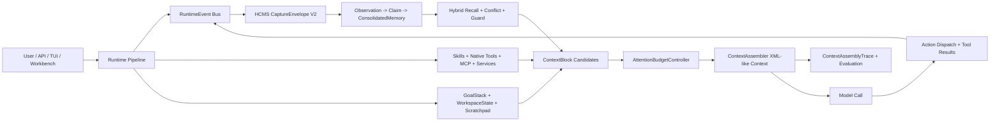

<p align="center">
  
</p>

<p align="center">
  <a href="./README.md">English</a> |
  <a href="./README_zh.md">中文</a>
</p>

<h1 align="center">Anvil</h1>

<p align="center">
  <strong>HCMS V2 + Runtime Context V2：让 agent 在同一个可审计运行时里记忆、推理、用工具并持续进化。</strong>
</p>

<p align="center">
  <a href="https://github.com/q2805187159/Anvil/actions/workflows/ci.yml"></a>
  <a href="./backend/pyproject.toml"></a>
  <a href="./frontend/package.json"></a>
  <a href="./docker-compose.yml"></a>
  <a href="./LICENSE"></a>
</p>

Anvil 是一个 harness-first 的 agent 运行平台，用同一套 runtime contracts 支撑长期记忆、上下文预算、typed tools、MCP 扩展、skills、隔离执行、结构化 trace、Gateway API、CLI/TUI 和浏览器操作员工作台。

新完成的 V2 栈把 memory 和 context 从“往 prompt 后面追加的文本”升级成真正的控制面数据。HCMS V2 用 Observation -> Claim -> ConsolidatedMemory 三态知识流沉淀证据；Runtime Context V2 把记忆、文件、工具、工作区状态、目标、警告和能力提示统一转换成可审计 `ContextBlock`，在每次模型调用前参与 attention budget 竞争。

## 为什么值得 Star

| 能力 | 价值 |
| --- | --- |
| HCMS V2 记忆引擎 | 三态知识流、证据片段、冲突记录、遗忘画像、过程模式、智慧洞察、MemoryGuard、混合召回、维护任务和 Memory API，让长期记忆有来源、有置信度、可追踪、可治理。 |
| Runtime Context V2 | 所有进入模型的内容都以结构化 context block 表达，并带 evidence、privacy、injection、conflict、compression、token 和 trace 元数据；memory 不再绕过 prompt budget。 |
| 自进化闭环 | capability usage、tool result、memory capture、procedure mining、wisdom promotion、evaluation trace 和 release gate 组成可度量的持续改进循环。 |
| 操作员级可观测性 | context assembly trace、selected memory、selected capability、tool result refs、conflict warnings、evaluation reports、smoke evidence 都可以用于调试和复盘，而不是散落在日志里。 |
| 一个 runtime，多种入口 | FastAPI gateway、embedded SDK、CLI、TUI、Next.js workbench、MCP、tools、skills 和 scheduled tasks 都消费 harness 拥有的同一套 contract。 |
| 带护栏的工具宇宙 | 文件、终端、浏览器、网页、媒体、文档、Google Workspace、memory、planning、delegation、MCP 和 plugin tools 都有 typed schema、可见性预算、输出预算、审批元数据和安全策略。 |
| 面向发布的工程体系 | contract generation、后端/前端测试、docs build、Docker mount check、HCMS benchmark、trace replay、release readiness profile 和清理指南都放在仓库里。 |

## V2 架构



## 核心能力

- HCMS V2 memory records：`ObservationRecord`、`EvidenceSpan`、`ClaimRecord`、`ConsolidatedMemory`、`ConflictRecord`、`ForgettingProfile`、`ProcedurePattern`、`WisdomInsight`、`MemorySearchResult`、`MemoryInjectionViewV2`、`CaptureEnvelopeV2`、`MemoryGuardDecision`。
- Runtime Context V2 flow：intake、intent profiling、query planning、retrieval、attention budgeting、context assembly、model call、action dispatch、observation handling、state update、memory capture、maintenance scheduling。
- Capability-aware runtime：native tools、skills、MCP tools、internal services、Top-K exposure、hidden capability summary、高风险工具 guardrail、tool result 引用化、workspace state capture。
- Gateway 和工作台：稳定后端路由、前端 API client、thread detail、Memory Workspace、HCMS console、Skills governance、MCP console、Tools Catalog、Configuration Center、Ops Console 和中英文 UI。
- Evaluation surfaces：trace replay、release smoke、HCMS recall benchmark、fallback check、latency/token gate、docs build 和 deterministic release readiness profile。

## 快速开始

前置条件：

- Python `3.12+`
- Node.js `22+`
- 推荐 Docker Engine + Compose v2 跑完整栈
- Linux、macOS、WSL 或 Git Bash 下可使用 `make`

```bash
git clone https://github.com/q2805187159/Anvil.git
cd Anvil
make config
```

编辑 `.env` 填写密钥，编辑 `config.yaml` 配置运行时。请设置 `GITHUB_TOKEN`，或修改 `git.token_env`；HCMS 版本元数据会把 Git 配置作为记忆基础配置的一部分。

启动完整栈：

```bash
make docker-start
```

默认端点：

- Frontend workbench: `http://127.0.0.1:13200`
- Backend gateway: `http://127.0.0.1:18000`
- Health check: `http://127.0.0.1:18000/health`

本地开发：

```bash
make install-backend-dev
make install-frontend
make backend
```

另开一个终端：

```bash
make frontend
```

## 文档导航

| 主题 | 文档 |
| --- | --- |
| 安装与部署 | [部署指南](./docs/guides/deployment.md) |
| 日常使用 | [使用指南](./docs/guides/usage.md) |
| 示例 | [Examples Guide](./examples/README.md) |
| 浏览器工作台与 runtime surfaces | [使用指南](./docs/guides/usage.md) |
| CLI | [CLI 参考](./docs/guides/cli.md) |
| TUI / shell | [TUI 指南](./docs/guides/tui.md) |
| Slash commands 和 runtime commands | [命令参考](./docs/guides/commands.md) |
| 配置字段 | [配置字段参考](./docs/guides/configuration.md) |
| 模型 Provider | [Model Provider 配置](./docs/guides/model-provider-configuration.md) |
| HCMS Memory API | [HCMS Memory API](./docs/guides/hcms-memory-api.md) |
| Extensions、Plugins、Skills、MCP | [扩展与能力面](./docs/guides/extensions-and-capability-surfaces.md) 和 [Plugins](./docs/guides/plugins.md) |
| Docker workspace | [Local Docker Workspace](./docs/guides/local-docker-workspace.md) |
| 发布验证 | [Release Verification](./docs/guides/release-verification.md) |
| 公共仓库清理 | [Open Source Release Checklist](./docs/guides/open-source-release.md) |

构建文档站：

```bash
make install-backend-dev
make docs
```

## 验证

```bash
make contracts
make check-docker-mounts
make test-backend
make test-frontend
make typecheck
make docs
```

发布门禁：

```bash
make release-readiness
```

更完整的门禁：

```bash
python scripts/run-release-readiness.py --profile full
```

## 项目结构

```text
Anvil/
|-- .github/               # CI、CodeQL、模板、Dependabot、CODEOWNERS
|-- backend/               # Gateway、embedded SDK、shell、harness package、tests
|-- docs/                  # 面向发布的文档
|-- docs/assets/           # 公开视觉资产
|-- examples/              # 无密钥示例和插件 fixture
|-- frontend/              # Next.js 操作员工作台
|-- plugins/               # 已审核示例插件包
|-- scripts/               # 启动、清理、契约生成、发布验证脚本
|-- skills/                # 初始内置 skills，属于公开发布面
|-- docker-compose.yml
|-- Makefile
|-- mkdocs.yml
`-- README.md
```

本地运行状态、调试数据库、截图、内部未来规划、一次性优化日志、生成的 docs site 和用户本地 Anvil Home 内容都已排除在公开发布面之外。详见 [Open Source Release Checklist](./docs/guides/open-source-release.md)。

## 安全

Anvil 可以执行工具、读写文件、调用 MCP server、处理上传、管理记忆、启动进程并委托子任务。除非你额外添加认证和 sandbox 边界，否则应把它视为可信环境系统。

推荐基线：

- `.env`、`config.yaml`、Anvil Home、运行时状态、调试数据库和生成产物不要进入 Git。
- 保持 `guardrails.enabled=true`。
- 共享环境中对 shell、network、filesystem write 启用审批。
- 启用 MCP 前先审查 command 和 environment variables。
- 公网部署必须放在认证、TLS 和网络 allowlist 后面。

漏洞报告方式见 [SECURITY.md](./SECURITY.md)。

## 社区

- Issues: https://github.com/q2805187159/Anvil/issues
- Discussions: https://github.com/q2805187159/Anvil/discussions
- Pull requests: https://github.com/q2805187159/Anvil/pulls
- 贡献指南: [CONTRIBUTING.md](./CONTRIBUTING.md)
- 行为准则: [CODE_OF_CONDUCT.md](./CODE_OF_CONDUCT.md)

## 许可证

Anvil 使用 [MIT License](./LICENSE) 开源。