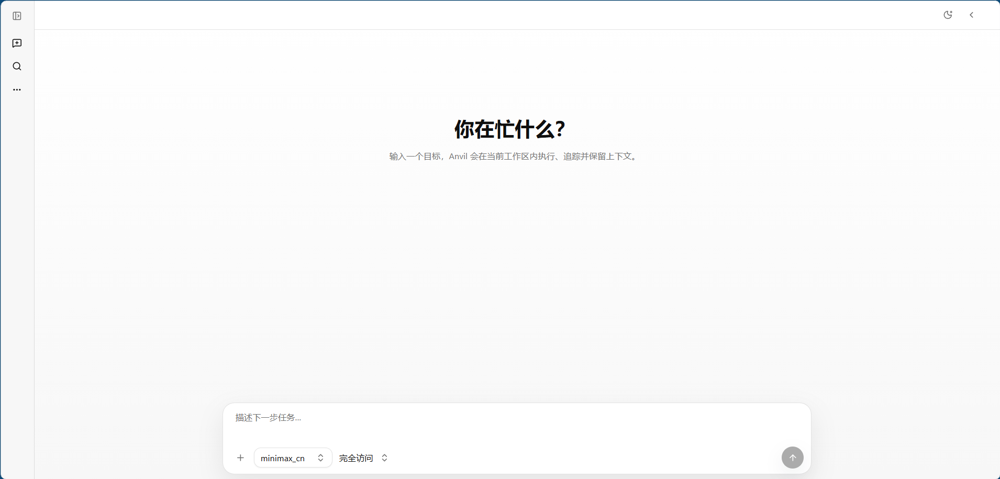
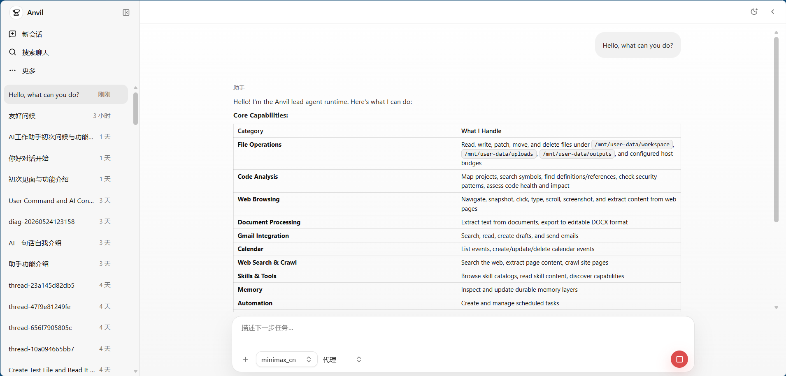
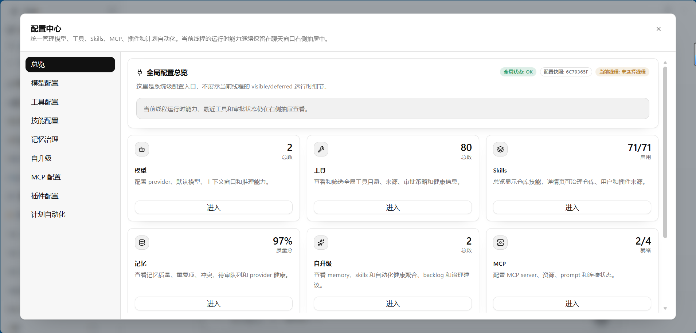

<p align="center">
  
</p>

<p align="center">
  <a href="./README.md">English</a> |
  <a href="./README_zh.md">中文</a>
</p>

# Anvil

<p align="center">
  <a href="https://github.com/q2805187159/Anvil/actions/workflows/ci.yml"></a>
  <a href="./backend/pyproject.toml"></a>
  <a href="./frontend/package.json"></a>
  <a href="./docker-compose.yml"></a>
  <a href="./LICENSE"></a>
</p>

Anvil 是一个 harness-first 的 agent 运行平台，用一套运行时真相支撑
操作员工作台、工具系统、长期记忆、MCP 扩展、隔离执行面和可自进化
agent 工作流。

它不是单一聊天界面。可复用 harness、FastAPI gateway、embedded SDK、
Shell/TUI、Next.js 工作台、记忆平台、工具目录、审批控制面和部署脚本，
都消费同一套 runtime contracts。

## 项目优势

Anvil 的定位不是“聊天套壳”，而是 agent 的运行时操作系统。它把记忆、工具、
审批、进程执行、上下文预算、子任务委托和可观测性压到同一个 harness 里，
再通过 HTTP、SDK、CLI、TUI 和浏览器工作台暴露出去。换句话说，Anvil
想解决的不是“能不能聊”，而是“agent 能不能长期、可控、可复盘地干活”。

| 优势 | 强在哪里 |
| --- | --- |
| Harness-first，不是 UI-first | 真正的平台核心在 `backend/packages/harness/anvil`；FastAPI gateway、embedded SDK、Shell/TUI、Next.js UI 都只是同一套 contract 的不同入口，不会各自长出一套运行逻辑。 |
| 记忆不是便签，是治理系统 | Session archive、curated runtime memory、profile facet、recall evidence、review queue、conflict resolution、staleness check、maintenance job、reflection job 共同把“长期记忆”做成可审计、可回滚、可维护的系统。 |
| 上下文工程内建 | Prompt snapshot、context ledger、JIT context、semantic code map、deferred tool schema、capability search、output budget、token usage、semantic compression、compaction diagnostics 都在运行时里，适合大项目和长任务。 |
| 工具宇宙带护栏 | 文件、终端/进程、网页、浏览器、媒体、文档、Google Workspace、MCP、skills、memory、automation、planning、delegation 都通过 typed toolset 组装，并带审批、安全元数据和可见性控制。 |
| 真正的操作员工作台 | Threads、uploads、artifacts、transcript projection、approvals、Memory governance、Skill governance、Plugin inspector、MCP console、Model config、Tools catalog 在一个中英文工作台里集中管理。 |
| 并行与定时不靠口号 | Bounded subagents、batch delegation record、task dependency、scheduled task、execution history、follow-up queue 让 Anvil 更像一个可调度的 agent 小队，而不是单个聊天窗口。 |
| 执行环境够硬 | Local shell、Docker、SSH、Singularity/Apptainer、Modal、Daytona、Vercel sandbox 适配器共用 process contract、mount metadata 和 capability reporting。 |
| 可评测、可训练、可发布 | Scrubbed trajectory export、ShareGPT-style conversion、tool-call parsing、quality report、memory recall benchmark、contract generation、smoke test、release-readiness gate 让 agent runtime 可以被度量，而不是玄学。 |

## 截图

| 工作台 | 会话详情 | Ops Console |
| --- | --- | --- |
|  |  |  |

## 快速开始

前置条件：

- Python `3.12+`
- Node.js `22+`
- 推荐使用 Docker Engine + Compose v2 跑完整栈
- Linux、macOS、WSL 或 Git Bash 下可使用 `make`

```bash
git clone https://github.com/q2805187159/Anvil.git
cd Anvil
make config
```

编辑 `.env` 填写密钥，编辑 `config.yaml` 配置模型路由，然后启动完整栈：

```bash
make docker-start
```

默认端点：

- Frontend: `http://127.0.0.1:13200`
- Backend: `http://127.0.0.1:18000`
- Health: `http://127.0.0.1:18000/health`

本地开发：

```bash
make install-backend-dev
make install-frontend
make backend
```

另开一个终端：

```bash
make frontend
```

## 核心能力

- Agent run engine：结构化流式事件、持久 thread state、transcript projection、
  prompt snapshot 和 execution mode。
- Memory platform：session archive、runtime memory、user profile、review queue、
  recall evidence、freshness scoring、conflict handling、profile facet、memory
  health check、retention、reflection 和 maintenance job。
- Tools catalog：capability search、schema deferral、output budget、artifact
  spillover、文件工具、网页/媒体/文档/浏览器工具和 process session。
- Code intelligence：compact project map、semantic index、symbol lookup、
  reference search、impact analysis、security scan 和 docs graph。
- Extension layer：MCP server、local skill、plugin registry、memory provider、
  model routing、terminal backend 和 generated contracts。
- Operator workbench：threads、uploads、artifacts、approvals、Memory Workspace、
  Skills governance、MCP console、Tools Catalog 和中英文 UI。
- CLI/TUI：setup、单步运行、模型选择、memory search、terminal session、
  approvals 和结构化用户交互。
- Evaluation surfaces：trajectory export、batch report、memory recall benchmark、
  smoke test、docs build 和 release-readiness check。

## 文档

推荐从这些文档开始：

- [使用指南](./docs/guides/usage.md)
- [部署指南](./docs/guides/deployment.md)
- [TUI 指南](./docs/guides/tui.md)
- [CLI 参考](./docs/guides/cli.md)
- [命令参考](./docs/guides/commands.md)
- [配置字段参考](./docs/guides/configuration.md)
- [模型 Provider 配置](./docs/guides/model-provider-configuration.md)
- [扩展与能力面](./docs/guides/extensions-and-capability-surfaces.md)
- [开源发布清单](./docs/guides/open-source-release.md)
- [发布验证](./docs/guides/release-verification.md)

构建文档站：

```bash
make install-backend-dev
make docs
```

## 验证

```bash
make contracts
make check-docker-mounts
make test-backend
make test-frontend
make typecheck
make docs
```

发布快速门禁：

```bash
make release-readiness
```

## 项目结构

```text
Anvil/
|-- .github/               # CI、CodeQL、模板、Dependabot、CODEOWNERS
|-- backend/               # Gateway、embedded SDK、shell、harness package、tests
|-- docs/                  # 面向发布的文档
|-- docs/assets/           # README 可用视觉资产
|-- examples/              # 无密钥示例和插件 fixture
|-- frontend/              # Next.js 操作员工作台
|-- plugins/               # 已审核示例插件包
|-- scripts/               # 启动、清理、契约生成、发布验证脚本
|-- docker-compose.yml
|-- Makefile
|-- mkdocs.yml
`-- README.md
```

本地运行状态、调试数据库、内部规划日志和未审核本地 skill pack 已从公开发布中排除。

## 安全

Anvil 可以执行工具、读写文件、调用 MCP server、处理上传、管理记忆、启动进程
并委托子任务。除非你额外添加认证和 sandbox 边界，否则应把它视为可信环境系统。

推荐基线：

- `.env`、`config.yaml`、Anvil Home、运行时状态和生成产物不要进入 Git。
- 保持 `guardrails.enabled=true`。
- 共享环境中对 shell、network、filesystem write 启用审批。
- 启用 MCP 前先审查 command 和 environment variables。
- 公网部署必须放在认证、TLS 和网络 allowlist 后面。

漏洞报告方式见 [SECURITY.md](./SECURITY.md)。

## 社区

- Issues: https://github.com/q2805187159/Anvil/issues
- Discussions: https://github.com/q2805187159/Anvil/discussions
- Pull requests: https://github.com/q2805187159/Anvil/pulls
- 贡献指南: [CONTRIBUTING.md](./CONTRIBUTING.md)
- 行为准则: [CODE_OF_CONDUCT.md](./CODE_OF_CONDUCT.md)

## 许可证

Anvil 使用 [MIT License](./LICENSE) 开源。
